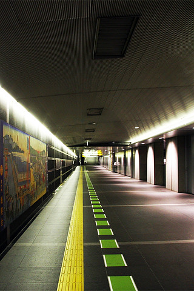
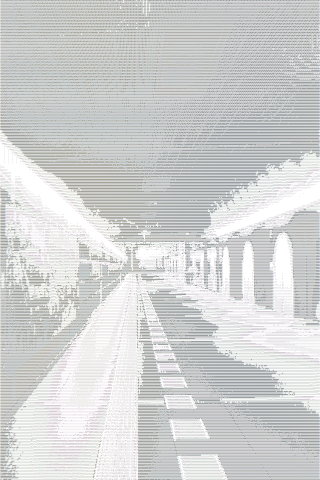
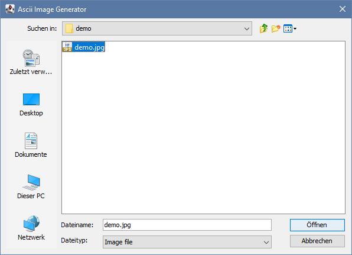
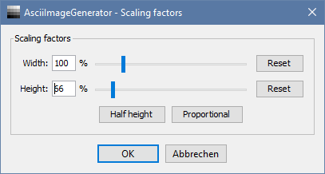
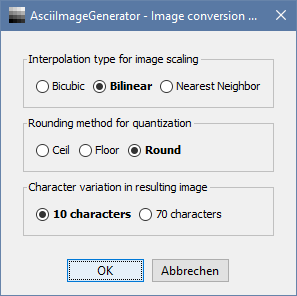
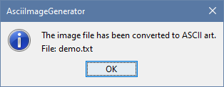

# ascii-image-generator
Generates ASCII art from a given image.

| **Table of contents** |
| --------------------- |
| **[Demo](#demo)** **[Features](#features)** **[Quick start](#quick-start)** **[Documentation](#documentation) (with Screenshots)** **[Motivation](#motivation)** **[Development](#development)** |

## Demo
| Original | ASCII art |
| -------- | --------- |
|  |  |
| ["Wallpaper: The Way" by OiMax](https://www.flickr.com/photos/72396314@N00/3733544507) is licensed with [CC BY 2.0](https://creativecommons.org/licenses/by/2.0/). | Screenshot of the [resulting text file](./demo/demo.txt) |

## Features
- Supported image formats: **bmp, gif, jpg, jpeg, png, tiff, wbmp**
- Independent width and height **pre-scaling**
- Multiple conversion parameters
    - Interpolation types for pre-scaling the image: **Bicubic, Bilinear, Nearest Neighbor**
    - Rounding method for quantization: **Ceil, Floor, Round**
    - Character variation: **10 characters, 70 characters**

## Quick start

### Requirements
The program requires at least the installation of [Java 8 or higher to run Gradle](https://docs.gradle.org/current/userguide/installation.html#sec:prerequisites).

### How to run
To start the application simply run the following command from the command line.

| Linux / macOS   | Windows             |
| --------------- | ------------------- |
| `./gradlew run` | `.\gradlew.bat run` |

## Documentation
### "Open file" dialog
Choose an image file in one of the supported formats to start.

**Supported formats:** bmp, gif, jpg, jpeg, png, tiff, wbmp

### "Scaling factors" dialog
Change the factors for pre-scaling the input image. It may be useful to change the aspect ratio of the input image since pixels are converted 1:1 into characters and the font you are displaying the ASCII image with is likely to not have an aspect ratio of 1:1. You can also take a tradeoff in image resolution and therefore reduce the resulting file size.

**Input range for _width_ and _height_:** 5-500% (Default: 100%)\
**Half height:** Set the _height_ to one half the _width_ resulting in a 2:1 ratio.\
**Proportional:** Set the _height_ to the _width_ resulting in a 1:1 ratio.

### "Image conversion methods" dialog
Change the appearance of the resulting ASCII image by changing the following settings to influence the conversion algorithm.

**Interpolation type for image scaling:**\
_Bicubic_: Uses [Bicubic interpolation](https://en.wikipedia.org/wiki/Bicubic_interpolation) for scaling. This results in a smoother image. This takes 16 pixels into account.\
_Bilinear_ (default): Uses [Bilinear interpolation](https://en.wikipedia.org/wiki/Bilinear_interpolation) for scaling. This is good for most purposes but may lead to some interpolation artifacts. This takes 4 pixels into account.\
_Nearest Neighbor_: Uses [Nearest-neighbor interpolation](https://en.wikipedia.org/wiki/Nearest-neighbor_interpolation) for scaling. This is useful for pixel art and preserves the blocky details.\
**Rounding method for quantization:**\
_Ceil_: Use [`Math::ceil`](https://docs.oracle.com/en/java/javase/15/docs/api/java.base/java/lang/Math.html#ceil(double)) for rounding values in the quantization process. This leads to more white details and reduces almost black details.\
_Floor_: Use [`Math::floor`](https://docs.oracle.com/en/java/javase/15/docs/api/java.base/java/lang/Math.html#floor(double)) for rounding values in the quantization process. This leads to more black details and reduces almost white details.\
_Round_ (default): Use [`Math::round`](https://docs.oracle.com/en/java/javase/15/docs/api/java.base/java/lang/Math.html#round(double)) for rounding values in the quantization process. This leads to an even distribution between almost white and almost black details.\
**Character variation in resulting image:**\
_10 characters_ (default): Uses the character sequence `@%#*+=-:. ` to represent the different levels of grey in the ASCII image.\
_70 characters_: Uses the character sequence ``$@B%8&WM#*oahkbdpqwmZO0QLCJUYXzcvunxrjft/\\|()1{}[]?-_+~<>i!lI;:,\"^`'. `` to represent the different levels of grey in the ASCII image.

### "Success" dialog
The image has been successfully converted and the resulting file name of the ASCII image is indicated.

## Motivation
There were many aspects that motivated me to start this project and
to program some things the way they are now:
1. Create awesome ASCII art with a simple algorithm.
1. Recreate a known grayscale algorithm from mathematical notation in self-describing code referencing the given notation
(after realizing that an algorithm like that is not as simple as taking the average of all color channels).
1. Work with some low level bit operations in Java.
1. Explore the usage of Java Swing in a small side project in contrast to JavaFX.
1. Explore the benefits and drawbacks of using `java.util.Optional` instead of `null` as a return value.

## Development

### Gradle Tasks
| Task          | Description |
| ------------- | ----------- |
| `run`         | Runs this project as a JVM application. |
| `debug`       | Runs this project as a JVM application with debugging enabled. - add program arguments with `-Pargs="..."` - attach a remote debugger via port `localhost:5005` |
| `showJavadoc` | Opens the generated Javadoc API documentation in the default browser. |

### ARGB32 color model
[ARGB32 color model](https://en.wikipedia.org/wiki/RGBA_color_model#ARGB32)

### Grayscale algorithm
[Grayscale algorithm](https://en.m.wikipedia.org/wiki/Grayscale#Colorimetric_(perceptual_luminance-preserving)_conversion_to_grayscale)

### Character sequences for ASCII art
[Character sequences](http://paulbourke.net/dataformats/asciiart/)
