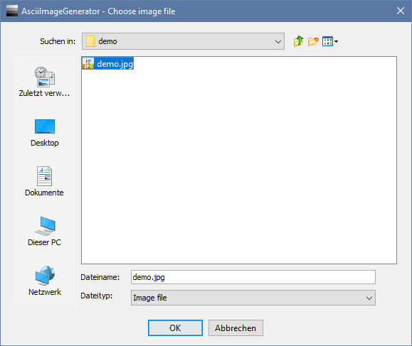

# ascii-image-generator
Generates ASCII art from a given image.

## Features
- Supported image formats: **bmp, gif, jpg, jpeg, png, tiff, wbmp**
- Independent width and height **pre-scaling**
- Multiple conversion parameters
    - Interpolation types for pre-scaling the image: **Bicubic, Bilinear, Nearest Neighbor**
    - Rounding method for quantization: **Ceil, Floor, Round**
    - Character variation: **10 characters, 70 characters**

### Demo
| original | ASCII art |
| -------- | --------- |
|  |  |
| ["Wallpaper: The Way" by OiMax](https://www.flickr.com/photos/72396314@N00/3733544507) is licensed with [CC BY 2.0](https://creativecommons.org/licenses/by/2.0/). | screenshot of resulting [./demo/demo.txt](./demo/demo.txt) |

### Screenshots
#### "Open file" dialog

#### "Scaling factors" dialog

#### "Image conversion methods" dialog

#### "Success" dialog

## Motivation

## Conversion technology

### ARGB32 color model
[ARGB32 color model](https://en.wikipedia.org/wiki/RGBA_color_model#ARGB32)

### Grayscale algorithm
[Grayscale algorithm](https://en.m.wikipedia.org/wiki/Grayscale#Colorimetric_(perceptual_luminance-preserving)_conversion_to_grayscale)

### Character sequences for ASCII art
[Character sequences](http://paulbourke.net/dataformats/asciiart/)
